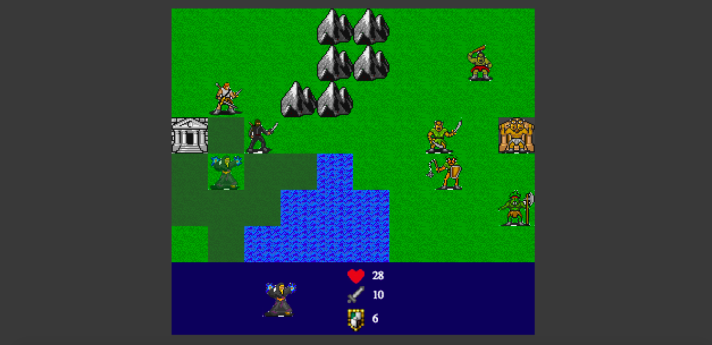
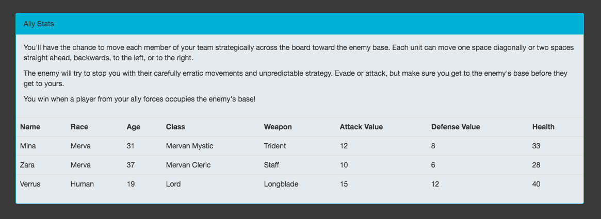

# Trident of Mina
## a tactical RPG
***Trident of Mina*** is the brainchild of <a href="https://github.com/blatde91">Daniel Blat</a>, who envisioned a new tactical RPG experience with challenging mechanics and interesting narrative-based armies. The game was built with the coding contributions by Daniel himself, Sara Hjelt, <a href="http://github.com/catslug">Lindsay Wall</a>, and <a href="http://github.com/brandon-Pfeiffer">Brandon Pfeiffer</a>.

### background
*Trident of Mina* uses <a href="http://phaser.io/">Phaser</a> as the game engine. All game tiles and sprites are by <a href="http://pousse.rapiere.free.fr/tome/">David E. Gervais</a> and used under a Creative Commons 3.0 License.

### signup
You must sign up for an account and log in to the site in order to play the game. Simply use the navigation bar at the top of the screen (or in the footer) to sign up/sign in. Once you sign in, you'll be taken to your dashboard where you can begin a new game. *Please note that while the game's database does associate game IDs with your username, save game functionality is not yet in place and the "Continue Game" buttons that show up on your dashboard are merely placeholders.*

### gameplay
Click the available tiles to move your players and watch your enemies make their move. Defeat enemy units and make your way across the map from home base. Capture the enemy fortress to win!

The game page also includes a table of your players' starting stats and information about their age, class, and weapon type.

